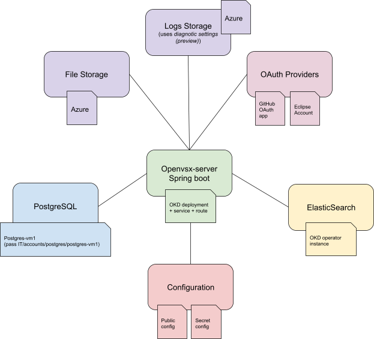

# Implementation Overview
## https://github.com/eclipse/openvsx
Core implementation
- Java/Spring server app
- Postgres DB
- ElasticSearch
- Blob storage (Azure or Google Cloud)
- TypeScript UI

## https://github.com/EclipseFdn/open-vsx.org
Deployment specific detail for open-vsx.org deployment
- [`application.yml`](https://github.com/EclipseFdn/open-vsx.org/blob/main/configuration/application.yml)
- Eclipse Foundation specific UI
- Publisher’s agreement

## https://github.com/open-vsx/publish-extensions
Scripts and Github actions for publishing 
- [`extensions.json`](https://github.com/open-vsx/publish-extensions/blob/master/extensions.json) file for list of extensions to auto-publish
- Github action for nightly auto-publishing
- [log](https://github.com/open-vsx/publish-extensions/actions/runs/6414215619) of results
- Github action for publishing a specific extension

# Publishing an Extension
- One must first have signed the [Publisher Agreement](https://open-vsx.org/publisher-agreement-v1.0). 
- Publisher agreement status visible in your [profile](https://open-vsx.org/user-settings/profile).
## Packaging
- Create a `.vsix` file with the `vsce package` command
- Minimal package includes `extension.js` and `package.json`
## Publishing
- Click ['Publish'](https://open-vsx.org/user-settings/extensions) and drag and drop `.vsix` file in the UI.
- Use the `ovsx publish --p [personal access token]` command. Requires a personal access token one generates from [profile settings](https://open-vsx.org/user-settings/tokens).
- Because file processing is asynchronous, extension will temporarily show as inactive until file processing completes, assuming no errors.

# Deployment
## Basic implementation architecture
[Documentation](https://github.com/eclipse/openvsx/wiki/Deploying-Open-VSX) on architecture of implementation and instructions for building and deploying.
### Database tables
#### Core Extension Information
```
user_data
extension
extension_review
extension_version
file_resource
namespace
namespace_membership
namespace_social_links
personal_access_token
```

### Recurring Jobs
- update-download-counts
- MonthlyAdminStatistics
- ElasticSearchUpdateIndex 
- Others ?
### Background processes
- File processing on publish
- Namespace rename/merge
- DB migration
- Extension removal
## Open-vsx.org Specifics

### Service Details
- Kubernetes Cluster - 2 containers
- Spring Boot v3
- Java version v17
- Postgres version and capacity
- Elastic version and capacity - 3 pods
- Blob storage
### Monitoring and Alerting
- Better Uptime
- Thresholds

# Deployment Process
Need to list steps here starting with someone submits a PR

# Common Error Situations and Remedies
Need help here

# Administration
- Administration requests appear as [issues](https://github.com/EclipseFdn/open-vsx.org/issues).
## Namespace ownership
- Ensure there is no a compelling reason a person should not be granted ownership.
    - A random person requesting ownership of 'redhat' namespace.
    - There is no current owner.
    - There are no other contributors ('Openvsx', auto-publishing ID, is a special case)
- If the namespace doesn't exist, create it.
- Assign the user (by Github ID) as owner, by adding or by changing status from 'Contributor' to 'Owner'.
- If extensions are being auto-published, alert the new owner
## Un-publishing extension versions
- This is a slow process.
- If un-publishing a larger number of versions, authentication will time out. Keep a second browser tab open to continually refresh.
## Renaming/merging namespaces
- Background process that can take some time (exponential backoff/retry)
## Questions about licenses and potentially malicious extensions
- Consult Visual Studio file
- Check with Wayne
## Merging Auto-publish PRs
- Committers on https://github.com/open-vsx/publish-extensions do this.


